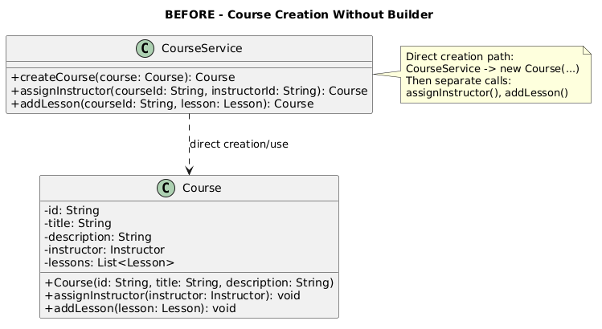
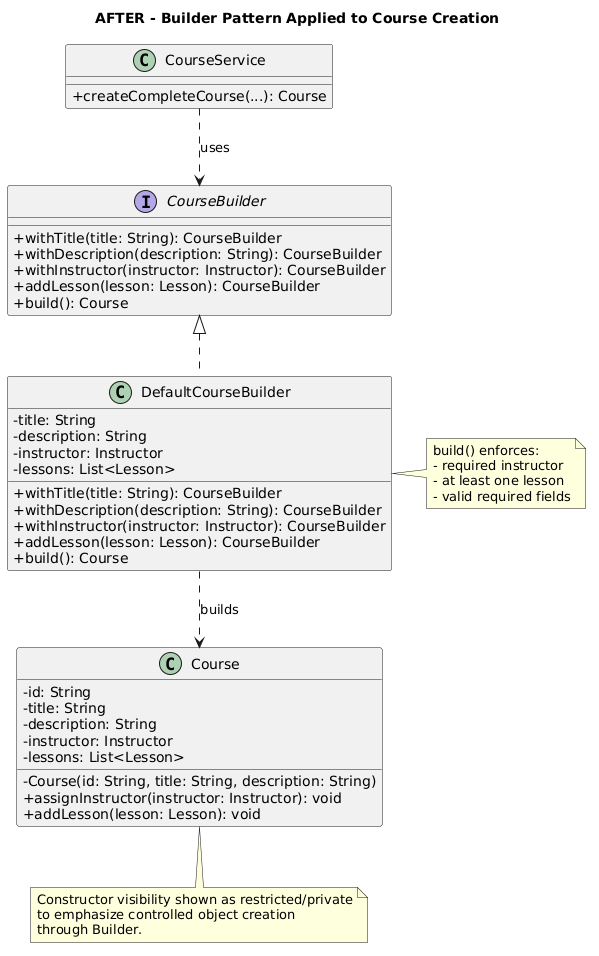

# UML Design & Technical Documentation  
## Case 1 – Builder Pattern (Course Creation)

---

## 1. Pattern Application

### Where was the pattern applied?
The Builder Pattern was applied in the course creation flow within the service layer, specifically in the complete course creation use-case.

### How was it applied?
A `CourseBuilder` abstraction and a concrete `DefaultCourseBuilder` were introduced to construct `Course` objects step-by-step:
- withTitle(...)
- withDescription(...)
- withInstructor(...)
- addLesson(...)
- build()

---

## 2. Structural Changes

The following architectural changes were introduced:

- Direct course instantiation logic was removed from `CourseService`
- A builder-based creation flow (`createCompleteCourse(...)`) was added
- Construction logic was encapsulated inside `CourseBuilder`
- Validation was centralized in the `build()` method

---

## 3. Interaction Flow

The updated object creation flow is:

Controller → CourseService → CourseBuilder → Course → Repository

This ensures that Course objects are fully constructed and validated before persistence.

---

## 4. Design Impact

The application of the Builder Pattern resulted in:

- Prevention of invalid course states (e.g., missing instructor or lessons)
- Improved maintainability by isolating construction logic
- Better separation of concerns between orchestration and object creation

---

## 5. Validation Strategy

All validation rules are enforced within the `build()` method:

- A course must have an instructor
- A course must contain at least one lesson

If validation fails, an exception is thrown, preventing invalid objects from being created.

---

## 6. UML Design Note

In the UML diagram, the `Course` constructor is marked as private (`-Course(...)`) to reflect the intended design where object creation is restricted to the Builder.

In the current implementation, this restriction is partially enforced through the builder-based creation flow, while a stricter enforcement can be applied in a production-ready version.

---

## 7. UML Diagrams

### Before Applying Builder

### After Applying Builder
